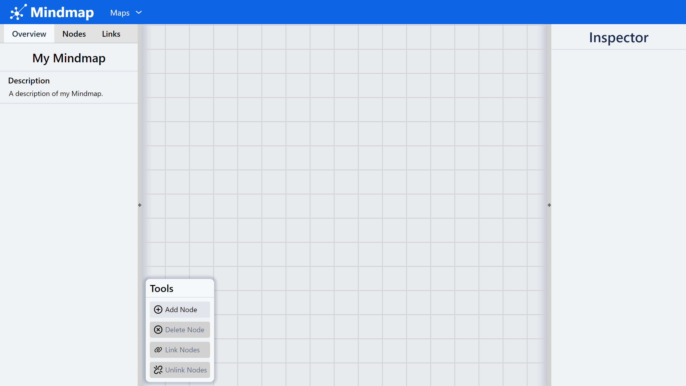
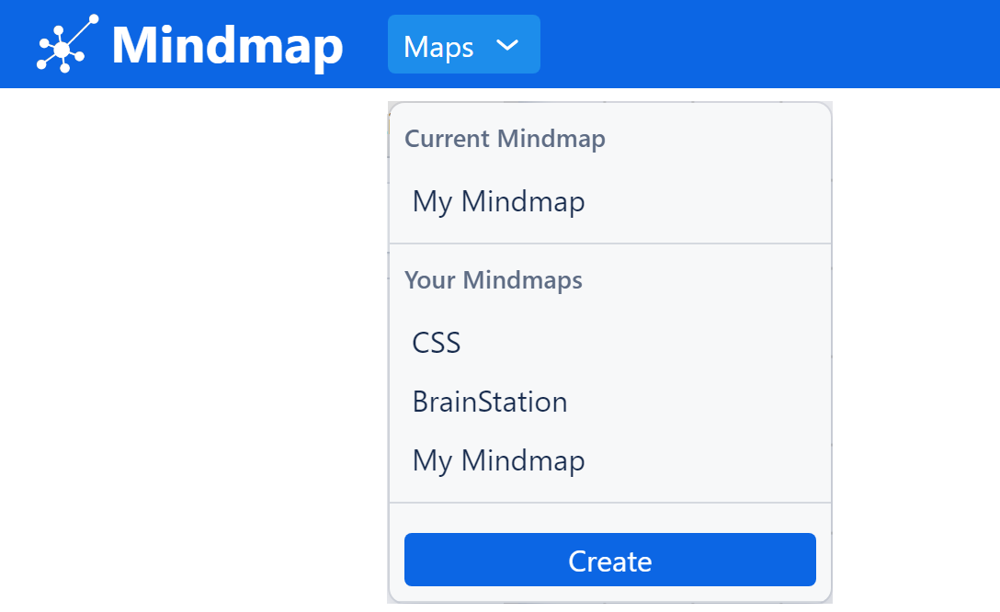
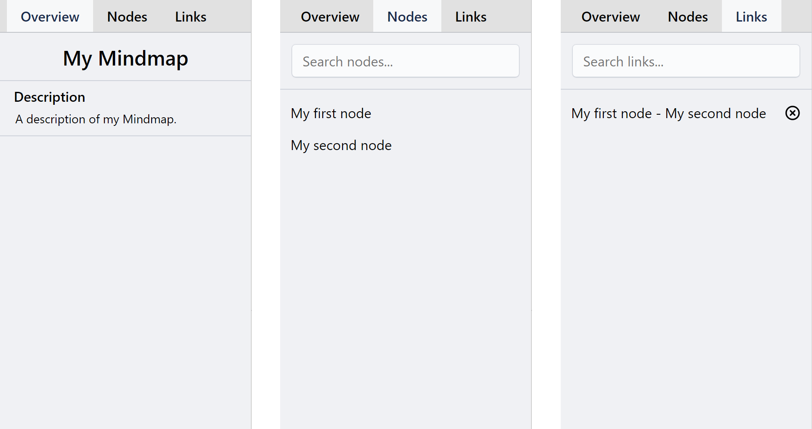
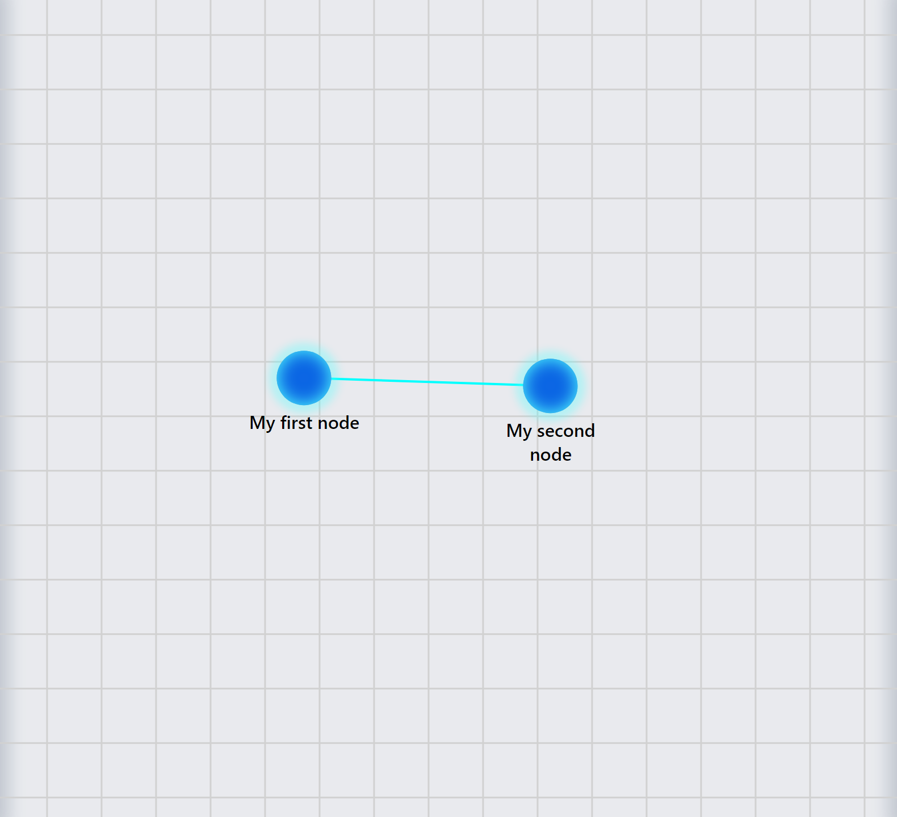
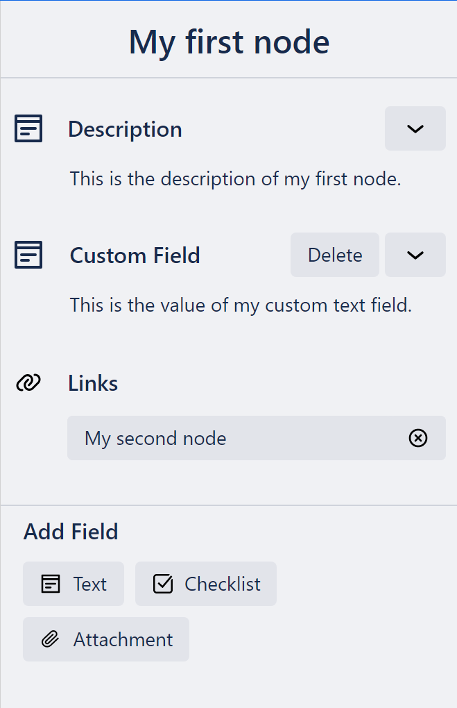

# Mindmap User Guide
Mindmap, this project, is an intuitive and flexible app that allows users to visually structure and organize their data using a mind map format. Each topic is represented by a node, and users can create links between related nodes. Users can add various types of fields to each node, including text, checklists, attachments, and more, making it easy to store and access different kinds of information.

### Table of Contents
[Getting Started](#getting-started) 
[Workspace Overview](#workspace-overview) 
[Creating a New Map](#creating-a-new-map) 
[Working with Nodes](#working-with-nodes) 
[Creating Connections (Links)](#creating-connections-links) 
[Adding and Editing Fields](#adding-and-editing-fields) 
[Shortcuts](#shortcuts) 

## Getting Started

## Dashboard Overview

The Mindmap application dashboard provides a comprehensive workspace for creating, managing, and exploring mind maps. Let's take a closer look at its main components:

### Navbar

The navigation bar located at the top of the dashboard allows easy access to various actions and navigation throughout the site. It includes the following items:

- **Navigation menu**: Click on the menu icon to expand a dropdown menu with options to navigate to different sections of the application.
- **Switch Maps**: Use this option to switch between different mind maps that you have created.
- **Create New Map**: Click on this button to create a new mind map.

### Sidebar

The sidebar is located on the left side of the dashboard and provides convenient access to different sections and features. It consists of the following tabs:

- **Overview**: This tab provides an overview of the selected mind map, displaying its name, description, and other relevant information.
- **Nodes**: Navigate to this tab to view a list of the nodes within the mind map. Click on a node to select it and view its details in the inspector.
- **Links**: Switch to this tab to view the list of connections (links) between nodes. Click on a link to select both nodes that it connects.

### Map

The central part of the dashboard is occupied by the mind map itself. This interactive and visually engaging component allows you to visualize your ideas and organize them hierarchically. Key features of the map include:

- **Panning and Zooming**: Use drag gestures or the zoom controls to navigate and zoom in/out of the mind map for a better view.
- **Interacting with Nodes**: Click on a node to select it, and view its details in the inspector. Drag nodes to reposition them within the map. 
  
### Inspector

The inspector panel, located on the right side of the dashboard, provides detailed information and editing capabilities for the selected node. Its features include:

- **Node Details**: View and edit the name, and description of the selected node.
- **Fields**: Add, modify, or delete various types of fields (text, checklist, attachment) to provide additional information and context for the node.
- **Links**: View the connections of the selected node. Click on a link to select the connected node.

### Tools Window

The tools window, located at the bottom left of the map component, provides access to various tools for creating, editing, and deleting nodes and links. It includes the following tools:

- **Add Node**: Click on the add tool to create a new node. Click on the map to place the node at the desired location.
- **Delete Nodes**: Click on the delete tool to delete all selected nodes.
- **Link Nodes**: With 2 nodes selected, click on the link tool to create a link between them.
- **Unlink Nodes**: With 2 nodes selected, click on the unlink tool to remove the link between them.

By utilizing these components effectively, you can navigate, manage, and create mind maps seamlessly within the Mindmap application.

## Creating a New Map
To create a new mind map, click on the "Maps" dropdown within the navigation menu and select "Create". This will open a dialog box where you can enter the name and description of the new map. Click on the "Create" button to create the map and open it in the dashboard.

## Working with Nodes
Nodes are the building blocks of your mind map. They represent individual topics or ideas that you want to organize and connect. In this section, you will learn how to add, select, move, and delete nodes within a mind map.

### Adding a Node
To add a new node to your mind map, follow these steps:
1. Click on the "Add Node" button from the tools window.
2. Click on the map to place the node at the desired location.

Alternatively, you can use a keyboard shortcut:
- Press the N key to create a node at the current cursor position on the map.

### Selecting Nodes
To select a node, click on it. The selected node will be highlighted in yellow. You can select multiple nodes by holding down the Shift key and either clicking on, or dragging a selection box around the nodes you want to select.

### Moving Nodes
To move a node, click and drag it to the desired location on the map.

### Deleting a Node
To delete a node, follow these steps:
1. Select the node you want to delete.
2. Click on the "Delete Nodes" button within the tools window.

Alternatively, you can use a keyboard shortcut:
- x or Delete key: Delete the selected node(s).

## Creating Connections (Links)
Links are the lines that connect nodes within a mind map. They represent the relationships between different topics and ideas. In this section, you will learn how to Link and Unlink nodes within a mind map.

### Linking Nodes
To create a link between two nodes, follow these steps:
1. Select 2 nodes that you want to link.
2. Click on the "Link Nodes" button within the tools window.

Alternatively, you can use a keyboard shortcut:
- l key: Link the selected nodes.

### Unlinking Nodes
To remove a link between two nodes, follow these steps:
1. Select 2 nodes that you want to unlink.
2. Click on the "Unlink Nodes" button within the tools window.

ALternatively, you can use a keyboard shortcut:
- u key: Unlink the selected nodes.

## Adding and Editing Fields
Fields are the different types of information that you can add to a node. They provide additional context and details for the node. In this section, you will learn how to add, edit, and delete fields within a node.

### Adding a Field
To add a new field to a node, follow these steps:
1. Select the node you want to add a field to.
2. Click on the field type within the inspector that you want to add.

### Editing a Field
To edit a field click on the name or content of the field within the inspector. Click outside the field to save the changes.

### Deleting a Field
To delete a field, click on the delete button next to the field within the inspector.

## Shortcuts
The following keyboard shortcuts are available within the Mindmap application:
- **n**: Create a new node at the current cursor position.
- **x** or **Delete**: Delete the selected node(s).
- **l**: Link the selected nodes.
- **u**: Unlink the selected nodes.
- **w a s d**: Pan the map in the corresponding direction.
- **Space**: Center the map on the selected node(s).